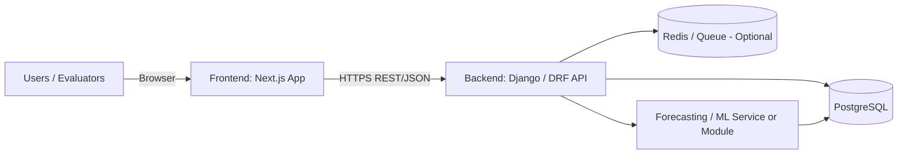
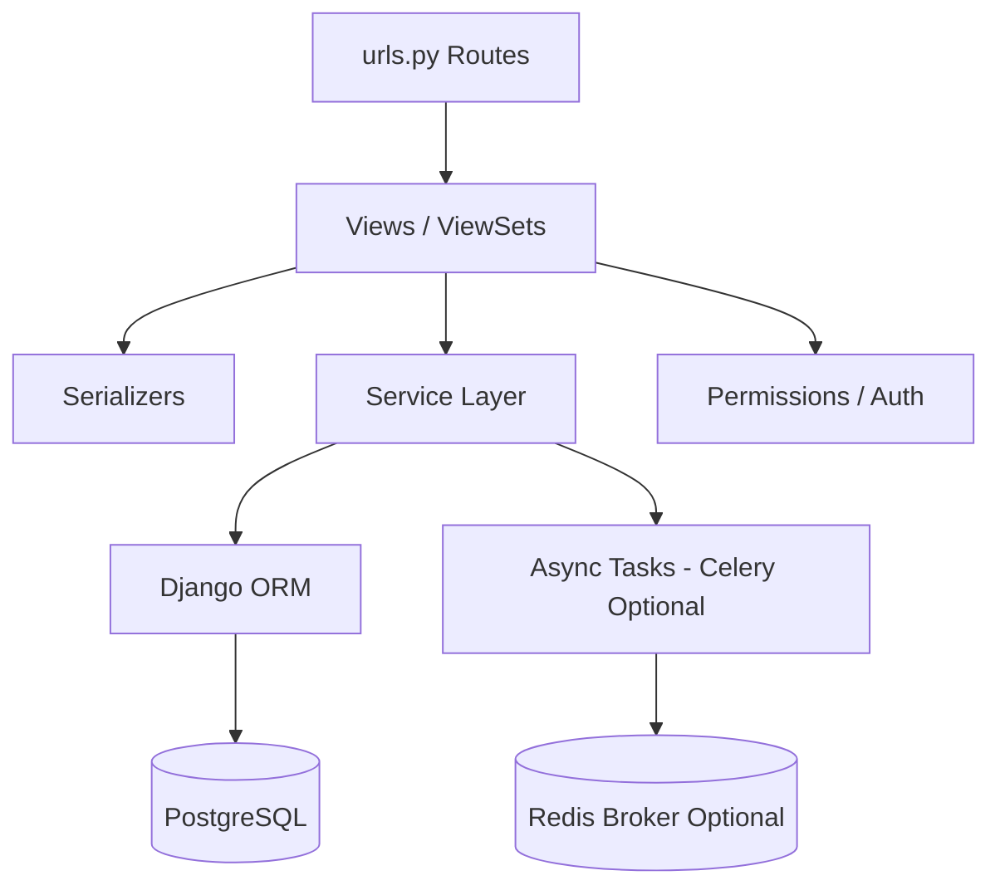

# Foresto | SmartRestaurant AI System — Backend (Django + PostgreSQL)

A secure, scalable **Django REST Framework** backend for the **SmartRestaurant AI System**.  
Provides APIs for restaurant operations including **sales**, **purchasing**, **inventory**, **suppliers**, and **AI-powered demand forecasting**, backed by a **PostgreSQL** database.

The backend is designed to integrate with the **Foresto Next.js frontend** and expose REST/JSON endpoints with authentication and role-based access patterns.

## Table of Contents

- [Project Overview](#project-overview)
- [Key Features](#key-features)
- [Tech Stack](#tech-stack)
- [Architecture Diagram](#architecture-diagram)
- [Dependencies](#dependencies)
- [Getting Started](#getting-started)
- [Database Setup (PostgreSQL)](#database-setup-postgresql)
- [Environment Variables](#environment-variables)
- [Available Commands](#available-commands)
- [Project Structure](#project-structure)
- [API](#api)
- [Authentication](#authentication)
- [Forecasting & Background Jobs](#forecasting--background-jobs)
- [Testing & Quality](#testing--quality)
- [Deployment](#deployment)
- [Version Control & Collaboration](#version-control--collaboration)
- [Contributing](#contributing)
- [Related Repositories](#related-repositories)
- [License](#license)

---

## Project Overview

This repository contains the backend API for the **SmartRestaurant AI System (Foresto)**.

It enables:
- Core restaurant workflows (CRUD + validations) for **items/products**, **suppliers**, **purchases**, **inventory**, and **sales**
- Aggregated analytics endpoints (KPIs, charts, summaries)
- AI/ML endpoints for **forecasting** (trigger training, generate forecasts, view results/history)
- Secure authentication for staff/admin users

Django officially supports PostgreSQL as a primary database backend. :contentReference[oaicite:0]{index=0}


## Key Features

- REST APIs built with Django REST Framework (DRF)
- PostgreSQL database for reliable production-grade storage
- Authentication (JWT/session-based depending on your implementation)
- CORS configuration to safely allow the Next.js frontend to access the API
- Forecasting module (train + predict + results/history)
- Optional async processing using Redis + Celery (recommended for long forecasting jobs)


## Tech Stack

- **Backend Framework**: Django
- **API**: Django REST Framework (DRF)
- **Database**: PostgreSQL
- **Auth**: JWT (commonly via `djangorestframework-simplejwt`) :contentReference[oaicite:1]{index=1}
- **CORS**: `django-cors-headers` :contentReference[oaicite:2]{index=2}
- **Async / Queue (Optional)**: Redis + Celery (recommended for ML training jobs)


## Architecture Diagram

### System Overview



### Backend Internal Flow



---

## Dependencies

### System Requirements

* **Python**: 3.10+ (recommended)
* **PostgreSQL**: 14+ (recommended)
* **pip**: latest
* **Optional**: Redis (if using Celery/background jobs)

### Python Packages

Your full dependency list is in `requirements.txt`.
Common packages in a DRF + PostgreSQL stack often include:

* `Django`
* `djangorestframework`
* `psycopg2-binary` (PostgreSQL driver)
* `django-cors-headers` ([PyPI][1])
* `djangorestframework-simplejwt` ([PyPI][2])
* (Optional) `celery`, `redis`, `django-celery-results`, `django-celery-beat`

---

## Getting Started

### 1) Clone the Repository

```bash
git clone https://github.com/anuradhajayathunga/foresto-be.git
cd foresto-be
```

### 2) Create & Activate a Virtual Environment

```bash
python -m venv env

# macOS/Linux
source env/bin/activate

# Windows (PowerShell)
env\Scripts\Activate.ps1
```

### 3) Install Dependencies

```bash
pip install -r requirements.txt
```


## Database Setup (PostgreSQL)

### 1) Create Database + User

Example commands:

```bash
# open postgres shell (method depends on OS)
psql -U postgres
```

```sql
CREATE DATABASE foresto_db;
CREATE USER foresto_user WITH PASSWORD 'foresto_password';
GRANT ALL PRIVILEGES ON DATABASE foresto_db TO foresto_user;
```

### 2) Configure Django to Use PostgreSQL

Django supports PostgreSQL through the `django.db.backends.postgresql` engine setting. ([Django Project][3])


## Environment Variables

Create a `.env` file in the project root (or use `.env.local` style if your repo already follows that).

**Example `.env`**

```env
# Django
DJANGO_SECRET_KEY=change-me
DJANGO_DEBUG=True
DJANGO_ALLOWED_HOSTS=localhost,127.0.0.1

# Database (PostgreSQL)
DB_NAME=foresto_db
DB_USER=foresto_user
DB_PASSWORD=foresto_password
DB_HOST=localhost
DB_PORT=5432

# CORS (Frontend origin)
CORS_ALLOWED_ORIGINS=http://localhost:3000

# Auth (if using JWT)
JWT_ACCESS_LIFETIME_MIN=15
JWT_REFRESH_LIFETIME_DAYS=7

# Optional: Redis / Celery (for background tasks)
REDIS_URL=redis://localhost:6379/0
CELERY_BROKER_URL=redis://localhost:6379/0
CELERY_RESULT_BACKEND=redis://localhost:6379/0
```

## Available Commands

### Migrations

```bash
python manage.py makemigrations
python manage.py migrate
```

### Create Admin User

```bash
python manage.py createsuperuser
```

### Run Development Server

```bash
python manage.py runserver
# API usually available at: http://127.0.0.1:8000/
```

### Collect Static (Production)

```bash
python manage.py collectstatic
```


## Project Structure

```text
foresto-be/
├── manage.py
├── config/                 # Django project settings (settings.py, urls.py, wsgi.py, asgi.py)
├── apps/                   # Django apps (domain modules)
│   ├── authentication/     # auth + users
│   ├── suppliers/          # suppliers module
│   ├── purchases/          # purchase invoices/items
│   ├── inventory/          # stock movements, items, categories
│   ├── sales/              # sales records, reports
│   ├── forecasting/        # train/predict endpoints + history
│   └── analytics/          # dashboards/KPIs
├── requirements.txt
├── .env.example
└── README.md
```

---

## API

### Base URL

Local development (default):

* `http://127.0.0.1:8000/`

Recommended API prefix:

* `/api/`

### Typical Modules (Example)
* **Auth**

  * `POST /api/auth/login/`
  * `POST /api/auth/refresh/`
  * `GET  /api/auth/me/`

* **Suppliers**

  * `GET/POST /api/suppliers/`
  * `GET/PUT/DELETE /api/suppliers/{id}/`

* **Purchases**

  * `GET/POST /api/purchases/invoices/`
  * `GET/POST /api/purchases/invoice-items/`

* **Inventory**

  * `GET/POST /api/inventory/items/`
  * `GET/POST /api/inventory/stock-movements/`

* **Forecasting**

  * `POST /api/forecasting/train/`
  * `GET  /api/forecasting/forecasts/`
  * `GET  /api/forecasting/forecasts/{id}/history/`

---

## Authentication

Most DRF + Next.js stacks use **JWT** (access + refresh) for API calls; Simple JWT is a common choice. ([GitHub][4])

### Common JWT Flow

1. Frontend submits credentials to login endpoint
2. Backend returns access + refresh tokens
3. Frontend attaches access token in `Authorization: Bearer <token>`
4. If access token expires, frontend calls refresh endpoint

### CORS

If your frontend runs on `http://localhost:3000`, configure CORS to allow that origin.
`django-cors-headers` is widely used for this. ([PyPI][1])


## Forecasting & Background Jobs

Forecasting training can be slow. Recommended approaches:

### Option A: Run Training Synchronously (Simple)

* Easiest for demos
* Not ideal for production (request may timeout)

### Option B: Run Training Asynchronously (Recommended)

* Use **Celery** workers with **Redis** as a broker
* API triggers a task, immediately returns a task/job id
* Frontend polls job status or reads results when ready

(If you use Celery + Redis, keep broker URLs in environment variables.)

---

## Testing & Quality

Suggested setup (adjust to your repo tools):

```bash
# Run unit tests
python manage.py test

# Linting (if configured)
ruff check .
# or
flake8
# or
black --check .
```

Recommended:

* Add GitHub Actions CI for `test + lint`
* Use pre-commit hooks for formatting/linting

---

## Deployment

### Production Checklist (Typical)

* `DJANGO_DEBUG=False`
* Strong `DJANGO_SECRET_KEY`
* Configure `ALLOWED_HOSTS`
* Set secure CORS origins
* Use PostgreSQL (managed DB if possible)
* Serve with Gunicorn/Uvicorn behind Nginx (or a PaaS)

---

## Version Control & Collaboration

### Branching Strategy (Git Flow Inspired)

* `main` → Production-ready
* `develop` → Integration branch
* `feature/*` → Feature branches
* `bugfix/*` → Bug fix branches
* `hotfix/*` → Urgent production fixes
* `release/*` → Release preparation

### Pull Request Workflow

1. Create branch from `develop`
2. Commit frequently with meaningful messages
3. Run tests + lint before pushing
4. Open PR → request review
5. Merge with squash (clean history)

### Commit Message Convention

Example:

```text
feat(forecasting): add async training endpoint
```

## Contributing

1. Setup local environment

```bash
git clone https://github.com/anuradhajayathunga/foresto-be.git
cd foresto-be
python -m venv env
source env/bin/activate
pip install -r requirements.txt
cp .env.example .env
```

2. Create a branch

```bash
git checkout -b feature/your-feature
```

3. Make changes + test

```bash
python manage.py test
```

4. Commit + push

```bash
git add .
git commit -m "feat(scope): describe change"
git push origin feature/your-feature
```

5. Open a PR to `develop`


## Related Repositories

* **Frontend Repository:** `foresto-fe` (https://github.com/anuradhajayathunga/foresto-fe.git)
* **Backend Repository:** `foresto-be` (https://github.com/anuradhajayathunga/foresto-be.git)


## License

Academic final year project at **Sri Lanka Institute of Information Technology**.
**License:** MIT


## Maintainers & Team

* Member 1: [JAYATHUNGA A G I A](https://github.com/anuradhajayathunga)
* Member 2: [THILAKARATHNAW P N S](https://github.com/NethumThilakarathna)
* Member 3: [ALAWATHTHA K A](https://github.com/AlawaththaKA)
* Member 4: [Fernando W G P N](https://github.com/PraveenNavodya)


## Support
For issues, questions, or contributions:
1. Check existing [Issues](https://github.com/anuradhajayathunga/foresto-be/issues)
2. Create a new Issue with detailed description
3. Email: hi.foresto@gmail.com (if applicable)

* Use GitHub Issues for bugs/tasks
* Provide clear reproduction steps + screenshots/logs

